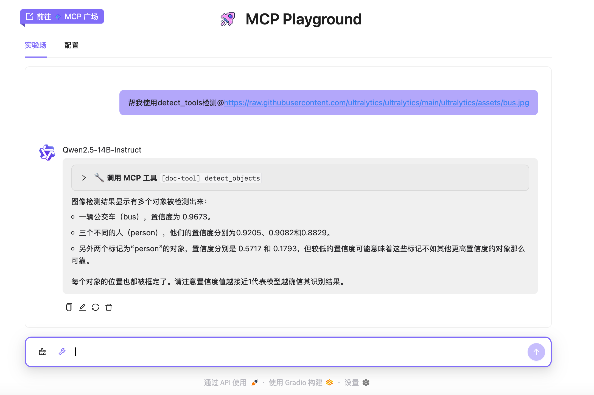

# MCP Playground for localhost(mcp client、 mcp server and local llm)

本仓库存储了本地部署llm（openai格式的apikey）的mcp-client方案
如需使用基于深度学习的计算机视觉模型mcp-server
请前往 https://github.com/MRonaldo-gif/mcp-server-cvdlt

MCP Playground是一个实验性项目，用于测试和展示MCP（Model Context Protocol）工具的能力。
Original Link: https://www.modelscope.cn/studios/Coloring/mcp-playground.git



## 功能特点

- 集成本地部署的基于sse的MCP工具
- 支持本地部署的LLM模型
- 用户友好的界面，便于交互和测试
- 支持cvdlt https://github.com/MRonaldo-gif/mcp-server-cvdlt

## 配置说明

### 环境变量

可以通过以下环境变量设置应用程序：

```bash
# LLM配置
export LLM_API_KEY="your_llm_api_key"
export LLM_BASE_URL="your_llm_api_base_url"
export LLM_MODEL_NAME="your_model_name"

# MCP服务器配置
export MCP_FILESYSTEM_PATH="path_to_filesystem_directory"
export MCP_FILESYSTEM_PATH2="path_to_another_filesystem_directory"
export MCP_DOC_TOOL_URL="url_to_doc_tool_service"
export MCP_MEMORY_FILE_PATH="path_to_memory_file"
```

## 安装与运行

1. 安装依赖：

```bash
pip install -r requirements.txt
```

2. 运行应用：

```bash
python app.py
```

## 使用方法

1. 在UI界面中选择"Qwen2.5-14B-Instruct (本地)"模型选项以使用本地部署的LLM
2. 点击输入框左侧的工具图标来选择要使用的MCP工具
3. 根据示例提示进行交互，例如：
   - YOLO-Tool工具: "检测这张图片中有哪些物体"

## MCP工具说明

### YOLO-Tool工具

用于对图像进行分析，包括对象检测、分割和姿态估计等。

